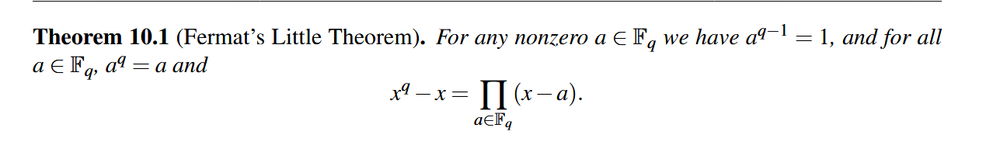

## idekCTF_2025_Crypto

### 1. Catch

```py
from Crypto.Random.random import randint, choice
import os

# In a realm where curiosity roams free, our fearless cat sets out on an epic journey.
# Even the cleverest feline must respect the boundaries of its world—this magical limit holds all wonders within.
limit = 0xe5db6a6d765b1ba6e727aa7a87a792c49bb9ddeb2bad999f5ea04f047255d5a72e193a7d58aa8ef619b0262de6d25651085842fd9c385fa4f1032c305f44b8a4f92b16c8115d0595cebfccc1c655ca20db597ff1f01e0db70b9073fbaa1ae5e489484c7a45c215ea02db3c77f1865e1e8597cb0b0af3241cd8214bd5b5c1491f

# Through cryptic patterns, our cat deciphers its next move.
def walking(x, y, part):
    # Each step is guided by a fragment of the cat's own secret mind.
    epart = [int.from_bytes(part[i:i+2], "big") for i in range(0, len(part), 2)]
    xx = epart[0] * x + epart[1] * y
    yy = epart[2] * x + epart[3] * y
    return xx, yy

# Enter the Cat: curious wanderer and keeper of hidden paths.
class Cat:
    def __init__(self):
        # The cat's starting position is born of pure randomness.
        self.x = randint(0, 2**256)
        self.y = randint(0, 2**256)
        # Deep within, its mind holds a thousand mysterious fragments.
        while True:
            self.mind = os.urandom(1000)
            self.step = [self.mind[i:i+8] for i in range(0, 1000, 8)]
            if len(set(self.step)) == len(self.step):
                break

    # The epic chase begins: the cat ponders and strides toward the horizon.
    def moving(self):
        tmp = []
        for _ in range(30):
            # A moment of reflection: choose a thought from the cat's endless mind.
            part = choice(self.step)
            self.step.remove(part)
            # With each heartbeat, the cat takes a cryptic step.
            xx, yy = walking(self.x, self.y, part)
            tmp.append(part)
            self.x, self.y = xx, yy
            # print(f"🐾 Cat steps: {self.x = }, {self.y = }")
            # print(f"🐾 Cat steps: {self.x % limit = }, {self.y % limit = }")
            # When the wild spirit reaches the edge, it respects the boundary and pauses.
            if self.x > limit or self.y > limit:
                self.x %= limit
                self.y %= limit
                # print(_)
                break
        print(tmp, _)

    # When the cosmos beckons, the cat reveals its secret coordinates.
    def position(self):
        return (self.x, self.y)

# Adventurer, your quest: find and connect with 20 elusive cats.
for round in range(20):
    try:
        print(f"👉 Hunt {round+1}/20 begins!")
        cat = Cat()

        # At the start, you and the cat share the same starlit square.
        human_pos = cat.position()
        print(f"🐱✨ Co-location: {human_pos}")
        print(f"🔮 Cat's hidden mind: {cat.mind.hex()}")

        # But the cat, ever playful, dashes into the unknown...
        cat.moving()
        print("😸 The chase is on!")

        print(f"🗺️ Cat now at: {cat.position()}")

        # Your turn: recall the cat's secret path fragments to catch up.
        mind = bytes.fromhex(input("🤔 Path to recall (hex): "))

        # Step by step, follow the trail the cat has laid.
        for i in range(0, len(mind), 8):
            part = mind[i:i+8]
            if part not in cat.mind:
                print("❌ Lost in the labyrinth of thoughts.")
                exit()
            human_pos = walking(human_pos[0], human_pos[1], part)

        # At last, if destiny aligns...
        if human_pos == cat.position():
            print("🎉 Reunion! You have found your feline friend! 🐾")
        else:
            print("😿 The path eludes you... Your heart aches.")
            exit()
    except Exception:
        print("🙀 A puzzle too tangled for tonight. Rest well.")
        exit()

# Triumph at last: the final cat yields the secret prize.
print(f"🏆 Victory! The treasure lies within: {open('flag.txt').read()}")
```

Có 20 vòng chơi.

Mỗi vòng:

- Tạo ra một Cat với tọa độ ngẫu nhiên và một danh sách các bước di chuyển step từ mind.

- Cat thực hiện một số bước di chuyển bí mật (tối đa 30 bước), mỗi bước dựa trên một phần 8 byte từ mind.

- Người chơi phải đoán chính xác các phần part (mỗi phần 8 bytes) mà con mèo đã dùng để di chuyển sao cho khi áp dụng chúng từ human_pos cũng đến đúng vị trí cuối cùng.

`limit = 0xe5db6a6d76...91f  # Một số nguyên lớn ~ 2048 bit`

Hàm walking(x, y, part)

```py
epart = [int.from_bytes(part[i:i+2], "big") for i in range(0, len(part), 2)]
xx = epart[0] * x + epart[1] * y
yy = epart[2] * x + epart[3] * y
```
Mục tiêu của người chơi

Biết:

    + Tọa độ ban đầu: P₀ = (x₀, y₀)

    + Danh sách các bước step có thể có (toàn bộ mind)

    + Tọa độ cuối: P_f = (x_f, y_f)

Tìm chuỗi part₁, part₂, ... sao cho:

`walking(...walking(walking(P₀, part₁), part₂)..., part_k) == P_f với mỗi part_i ∈ step.`

Do cách số được tính ở đây rất nhỏ so với limit nên phép mod không được thử hiện. Ta chỉ cần thử tất cả các nước đi có thể, nếu nước đi nào khiến điểm đến bạn đầu lớn hơn điểm đến lúc sau thì đó là nước đi sai. Thử lần lượt tới khi tìm lại được hết tất cả các nước đi và tới khi có được flag.

```py
import sys
import os
os.environ['TERM'] = 'xterm-256color'

from tqdm import *
from pwn import *

limit = 0xe5db6a6d765b1ba6e727aa7a87a792c49bb9ddeb2bad999f5ea04f047255d5a72e193a7d58aa8ef619b0262de6d25651085842fd9c385fa4f1032c305f44b8a4f92b16c8115d0595cebfccc1c655ca20db597ff1f01e0db70b9073fbaa1ae5e489484c7a45c215ea02db3c77f1865e1e8597cb0b0af3241cd8214bd5b5c1491f


s = connect("catch.chal.idek.team", 1337)
for _ in trange(20):
    s.recvuntil("Co-location: ")
    start_pos = eval(s.recvline().strip().decode())
    s.recvuntil(b"Cat's hidden mind: ")
    mind = bytes.fromhex(s.recvline().strip().decode())
    s.recvuntil(b"Cat now at: ")
    end_pos = eval(s.recvline().strip().decode())
    step = [mind[i:i+8] for i in range(0, 1000, 8)]
    F = GF(limit)


    def walking(x, y, part):
        # Each step is guided by a fragment of the cat's own secret mind.
        epart = [int.from_bytes(part[i:i+2], "big") for i in range(0, len(part), 2)]
        e = matrix(F, 2, 2, [
            epart[0], epart[1],
            epart[2], epart[3]
        ])

        xx, yy = (e ^-1) * vector(F, [x, y])
        return xx, yy

    w = []
    now = end_pos

    for i in range(30):
        for step_ in (step):
            tmp = walking(now[0], now[1], step_)
            if tmp[0] <= now[0] and tmp[1] <= now[1]:
                w.append(step_)
                now = tmp
                break

    payload = b"".join(w[::-1])
    s.sendline(payload.hex().encode())
    
s.interactive()
```

### 2. Diamond_ticket

```py
from Crypto.Util.number import *

#Some magic from Willy Wonka
p = 170829625398370252501980763763988409583
a = 164164878498114882034745803752027154293
b = 125172356708896457197207880391835698381

def chocolate_generator(m:int) -> int:
    return (pow(a, m, p) + pow(b, m, p)) % p

#The diamond ticket is hiding inside chocolate
diamond_ticket = open("flag.txt", "rb").read()

assert len(diamond_ticket) == 26
assert diamond_ticket[:5] == b"idek{"
assert diamond_ticket[-1:] == b"}"
diamond_ticket = bytes_to_long(diamond_ticket[5:-1])

flag_chocolate = chocolate_generator(diamond_ticket)
chocolate_bag = []

#Willy Wonka are making chocolates
for i in range(1337):
    chocolate_bag.append(getRandomRange(1, p))

#And he put the golden ticket at the end
chocolate_bag.append(flag_chocolate)

#Augustus ate lots of chocolates, but he can't eat all cuz he is full now :D
remain = chocolate_bag[-5:]

#Compress all remain chocolates into one
remain_bytes = b"".join([c.to_bytes(p.bit_length()//8, "big") for c in remain])

#The last chocolate is too important, so Willy Wonka did magic again
P = getPrime(512)
Q = getPrime(512)
N = P * Q
e = bytes_to_long(b"idek{this_is_a_fake_flag_lolol}")
d = pow(e, -1, (P - 1) * (Q - 1))
c1 = pow(bytes_to_long(remain_bytes), e, N)
c2 = pow(bytes_to_long(remain_bytes), 2, N) # A small gift

#How can you get it ?
print(f"{N = }")
print(f"{c1 = }")
print(f"{c2 = }") 
print(f"{flag_chocolate = }")
"""
N = 85494791395295332945307239533692379607357839212287019473638934253301452108522067416218735796494842928689545564411909493378925446256067741352255455231566967041733698260315140928382934156213563527493360928094724419798812564716724034316384416100417243844799045176599197680353109658153148874265234750977838548867
c1 = 27062074196834458670191422120857456217979308440332928563784961101978948466368298802765973020349433121726736536899260504828388992133435359919764627760887966221328744451867771955587357887373143789000307996739905387064272569624412963289163997701702446706106089751532607059085577031825157942847678226256408018301
c2 = 30493926769307279620402715377825804330944677680927170388776891152831425786788516825687413453427866619728035923364764078434617853754697076732657422609080720944160407383110441379382589644898380399280520469116924641442283645426172683945640914810778133226061767682464112690072473051344933447823488551784450844649
"""

23025946756534273889722945961681121292
23025946756534273889722945961681121292
```

Ta có 2 phương trình như sau:
+ $m^e = c_1 \pmod{N}$
+ $m^2 = c_2 \pmod{N}$

ta có thể dễ dàng tìm lại được m và khi đó ta có phương trình mới như sau:

$$a^x + b^x = m \pmod{N}$$

Khi tính mối quan hệ giữa a và b thì ta có:

$$a ^ {73331} = b \pmod{p} \to a^x + a^{73331 * x} = m \pmod{p}$$

đặt $y = a^x$

$$y + y^{73331} = m \pmod{p}$$

Như trong tài liệu này [Tài liệu](https://student.cs.uwaterloo.ca/~cs487/handouts/scriptFqFact.pdf), ta có thể thấy như sau:



tức $x^p - x$ có chứa nghiệm là tất cả các phần tử, khi đó ta có thể dễ dàng tính được nghiệm của $y + y^{73331} = m \pmod{N}$ bằng cách gcd (do p là smooth prime nên ta có thể dễ dàng tính). Khi đó ta chỉ cần log là có thể dễ dàng tìm lại được $m % p$. Nhưng do `m` lớn hơn `p` nên ta cần sử dụng thêm LLL để có thể tìm lại được flag đúng.

```py
from Crypto.Util.number import *
from sympy import gcdex
from Crypto.Util.number import *

N = 85494791395295332945307239533692379607357839212287019473638934253301452108522067416218735796494842928689545564411909493378925446256067741352255455231566967041733698260315140928382934156213563527493360928094724419798812564716724034316384416100417243844799045176599197680353109658153148874265234750977838548867
c1 = 27062074196834458670191422120857456217979308440332928563784961101978948466368298802765973020349433121726736536899260504828388992133435359919764627760887966221328744451867771955587357887373143789000307996739905387064272569624412963289163997701702446706106089751532607059085577031825157942847678226256408018301
c2 = 30493926769307279620402715377825804330944677680927170388776891152831425786788516825687413453427866619728035923364764078434617853754697076732657422609080720944160407383110441379382589644898380399280520469116924641442283645426172683945640914810778133226061767682464112690072473051344933447823488551784450844649
e = bytes_to_long(b"idek{this_is_a_fake_flag_lolol}")
assert e % 2 == 1

p = 170829625398370252501980763763988409583
a = 164164878498114882034745803752027154293
b = 125172356708896457197207880391835698381
c = int.from_bytes(long_to_bytes(c1 * pow(c2, -(e // 2), N) % N)[-16:], "big")

k = GF(p)(b).log(a)

PR.<x> = PolynomialRing(GF(p))
f = x + x**k - c
g = pow(x, p, f) - x
X = [r for r in f.gcd(g).roots()][0][0]
m = GF(p)(X).log(a)
# print(f'{m = }') # 4807895356063327854843653048517090061
F = PolynomialRing(Zmod((p - 1)//2), 'x', 20)
xs = F.gens()

def eval_bytes(x):
    output = 0
    for i, byte in enumerate(x[::-1]):
        output += (256**i) * byte
    return output

import string

alpha = string.ascii_lowercase + string.ascii_uppercase + string.digits
min_char = ord(min(alpha))
max_char = ord(max(alpha))
i = (max_char - min_char) // 2
xs_ = [_ + i + min_char for _ in xs]
xs_ = eval_bytes(xs_) - m

M = xs_.coefficients()
M = block_matrix(ZZ, [
    [column_matrix(M), 1],
    [(p - 1) // 2, 0]
])

w = diagonal_matrix(ZZ, [1] + [i] * 20 + [1], sparse = 0)

M = (M/w).LLL() * w

for _ in M:
    _ = sign(_[-1]) * _

    tmp = [i + __ + min_char for __ in _[1:-1]]
    print(bytes(tmp))
```

### 3. Sadness ECC

```py
from Crypto.Util.number import *
from secret import n, xG, yG
import ast

class DummyPoint:
    O = object()

    def __init__(self, x=None, y=None):
        if (x, y) == (None, None):
            self._infinity = True
        else:
            assert DummyPoint.isOnCurve(x, y), (x, y)       
            self.x, self.y = x, y
            self._infinity = False

    @classmethod
    def infinity(cls):
        return cls()

    def is_infinity(self):
        return getattr(self, "_infinity", False)

    @staticmethod
    def isOnCurve(x, y):
        return pow(y - 1337, 3, n) == pow(x, 2, n)

    def __add__(self, other):
        if other.is_infinity():
            return self
        if self.is_infinity():
            return other

        # ——— Distinct‑points case ———
        if self.x != other.x or self.y != other.y:
            dy    = self.y - other.y
            dx    = self.x - other.x
            inv_dx = pow(dx, -1, n)
            prod1 = dy * inv_dx
            s     = prod1 % n

            inv_s = pow(s, -1, n)
            s3    = pow(inv_s, 3, n)

            tmp1 = s * self.x
            d    = self.y - tmp1

            d_minus    = d - 1337
            neg_three  = -3
            tmp2       = neg_three * d_minus
            tmp3       = tmp2 * inv_s
            sum_x      = self.x + other.x
            x_temp     = tmp3 + s3
            x_pre      = x_temp - sum_x
            x          = x_pre % n

            tmp4       = self.x - x
            tmp5       = s * tmp4
            y_pre      = self.y - tmp5
            y          = y_pre % n

            return DummyPoint(x, y)

        dy_term       = self.y - 1337
        dy2           = dy_term * dy_term
        three_dy2     = 3 * dy2
        inv_3dy2      = pow(three_dy2, -1, n)
        two_x         = 2 * self.x
        prod2         = two_x * inv_3dy2
        s             = prod2 % n

        inv_s         = pow(s, -1, n)
        s3            = pow(inv_s, 3, n)

        tmp6          = s * self.x
        d2            = self.y - tmp6

        d2_minus      = d2 - 1337
        tmp7          = -3 * d2_minus
        tmp8          = tmp7 * inv_s
        x_temp2       = tmp8 + s3
        x_pre2        = x_temp2 - two_x
        x2            = x_pre2 % n

        tmp9          = self.x - x2
        tmp10         = s * tmp9
        y_pre2        = self.y - tmp10
        y2            = y_pre2 % n

        return DummyPoint(x2, y2)

    def __rmul__(self, k):
        if not isinstance(k, int) or k < 0:
            raise ValueError("Choose another k")

        R = DummyPoint.infinity()
        addend = self
        while k:
            if k & 1:
                R = R + addend
            addend = addend + addend
            k >>= 1
        return R

    def __repr__(self):
        return f"DummyPoint({self.x}, {self.y})"

    def __eq__(self, other):
        return self.x == other.x and self.y == other.y      

if __name__ == "__main__":
    G = DummyPoint(xG, yG)
    print(f"{n = }")
    stop = False
    while True:
        print("1. Get random point (only one time)\n2. Solve the challenge\n3. Exit")
        try:
            opt = int(input("> "))
        except:
            print("❓ Try again."); continue

        if opt == 1:
            if stop:
                print("Only one time!")
            else:
                stop = True
                k = getRandomRange(1, n)
                P = k * G
                print("Here is your point:")
                print(P)

        elif opt == 2:
            ks = [getRandomRange(1, n) for _ in range(2)]   
            Ps = [k * G for k in ks]
            Ps.append(Ps[0] + Ps[1])

            ans = sum([[P.x, P.y] for P in Ps], start=[])   
            print("Sums (x+y):", [P.x + P.y for P in Ps])   
            try:
                check = ast.literal_eval(input("Your reveal: "))
            except:
                print("Couldn't parse.");

            if ans == check:
                print("Correct! " + open("flag.txt").read())
            else:
                print("Wrong...")
            break

        else:
            print("Farewell.")
            break
```

Mình sử dụng chatGPT để tìm lại curve thì có thể dễ dàng tìm được dạng curve sử dụng trong bài này như sau:

$$x^2 = (y - 1337)^3 \pmod{n}$$

Ngoài ra ta có:
+ c1 = a + b; P = (a, b)
+ c2 = c + d; Q = (c, d)
+ c3 = E.x + E.y; E = P + Q

Bằng code sympy thì mình có mối quan hệ như sau:

$$
E_x = \frac{a^3 - 3a^2c - ab^3 + 4011ab^2 + 3abd^2 - 8022abd + 3ac^2 - 2ad^3 + 4011ad^2 + 2b^3c - 3b^2cd - 4011b^2c + 8022bcd - c^3 + cd^3 - 4011cd^2}{(b - d)^3}
$$

$$
E_y = \frac{a^2 - 2ac - b^3 + b^2d + 4011b^2 + bd^2 - 8022bd + c^2 - d^3 + 4011d^2}{(b - d)^2}
$$

khi đó mình đã có thể dùng groeber basis để tìm lại a, b, c, d một cách đễ dàng và có được flag

```py
class DummyPoint:
    O = object()

    def __init__(self, x=None, y=None):
        if (x, y) == (None, None):
            self._infinity = True
        else:
            assert DummyPoint.isOnCurve(x, y), (x, y)
            self.x, self.y = x, y
            self._infinity = False

    @classmethod
    def infinity(cls):
        return cls()

    def is_infinity(self):
        return getattr(self, "_infinity", False)

    @staticmethod
    def isOnCurve(x, y):
        return "<REDACTED>"

    def __add__(self, other):
        if other.is_infinity():
            return self
        if self.is_infinity():
            return other

        # ——— Distinct‑points case ———
        if self.x != other.x or self.y != other.y:
            dy    = self.y - other.y
            dx    = self.x - other.x
            inv_dx = pow(dx, -1, n)
            prod1 = dy * inv_dx
            s     = prod1 % n

            inv_s = pow(s, -1, n)
            s3    = pow(inv_s, 3, n)

            tmp1 = s * self.x
            d    = self.y - tmp1

            d_minus    = d - 1337
            neg_three  = -3
            tmp2       = neg_three * d_minus
            tmp3       = tmp2 * inv_s
            sum_x      = self.x + other.x
            x_temp     = tmp3 + s3
            x_pre      = x_temp - sum_x
            x          = x_pre % n

            tmp4       = self.x - x
            tmp5       = s * tmp4
            y_pre      = self.y - tmp5
            y          = y_pre % n

            return DummyPoint(x, y)

        dy_term       = self.y - 1337
        dy2           = dy_term * dy_term
        three_dy2     = 3 * dy2
        inv_3dy2      = pow(three_dy2, -1, n)
        two_x         = 2 * self.x
        prod2         = two_x * inv_3dy2
        s             = prod2 % n

        inv_s         = pow(s, -1, n)
        s3            = pow(inv_s, 3, n)

        tmp6          = s * self.x
        d2            = self.y - tmp6

        d2_minus      = d2 - 1337
        tmp7          = -3 * d2_minus
        tmp8          = tmp7 * inv_s
        x_temp2       = tmp8 + s3
        x_pre2        = x_temp2 - two_x
        x2            = x_pre2 % n

        tmp9          = self.x - x2
        tmp10         = s * tmp9
        y_pre2        = self.y - tmp10
        y2            = y_pre2 % n

        return DummyPoint(x2, y2)

    def __rmul__(self, k):
        if not isinstance(k, int) or k < 0:
            raise ValueError("Choose another k")
        
        R = DummyPoint.infinity()
        addend = self
        while k:
            if k & 1:
                R = R + addend
            addend = addend + addend
            k >>= 1
        return R

    def __repr__(self):
        return f"DummyPoint({self.x}, {self.y})"

    def __eq__(self, other):
        return self.x == other.x and self.y == other.y

# # E = EllipticCurve(GF(p), [0, -1])  # Dummy curve for testing

n = 18462925487718580334270042594143977219610425117899940337155124026128371741308753433204240210795227010717937541232846792104611962766611611163876559160422428966906186397821598025933872438955725823904587695009410689230415635161754603680035967278877313283697377952334244199935763429714549639256865992874516173501812823285781745993930473682283430062179323232132574582638414763651749680222672408397689569117233599147511410313171491361805303193358817974658401842269098694647226354547005971868845012340264871645065372049483020435661973539128701921925288361298815876347017295555593466546029673585316558973730767171452962355953
output = [7960980524994331167139796279737502768891637057137936769868869147644569015347387987867009397206380681991279111575590387078112395384540340388197681680306758614070445884710105041611055444385314926655339552501159150123757580221502781930842906282837878275995348194510264084146735737716672569931805554535076465333427218986290113469484004494268047331906656823942359556144269237861056749522077131285672499618890761259716848698384837462930378879080596569798835071949924150647612338242407907529587639451957115856224394771759215408087357094129313740637076682586693296771539394263098423375001790011270541087134813689918097448622, 18446420057688244356550972553946310413153376677399099353504278685132834753426542709436854573156128726318711630797383263970584422627245809806516762125382663363273021980633327908261352952941568918989388718742800459419543089750011096685544242541968430512012722270501449355728857196072164113961183608372755625821763457216079512065369947935470319917023935649015874397717700690076212685041955055773797843559499081033965005570816158114767443754061508659865432239756805373443945594096112090997727087851483454312968772256096661853827283484903844842007350288577441136827272075944676266520207176368275553518538990669835528048018, 24778181283330377442260431430363444289521518758147081435375034309982969961064922366893316168661193888094001609057535937075361245893672275923321598179988274930621385092481290178380463777937886032930249102388120784721372913218752002301593895435437400903553395367616320916632087114983217195779199880358227325239110658962624423602686911598654404429281310621306676425988482721877746285752405131455441275596541139491425985952915805263495976723694487861648227612622708900763912961068418713817553159051505992926565465978381197851666554391734302529456026240637758993989107124007079114261787057599177387342476302837437644115155]

F.<a, b, c, d> = PolynomialRing(Zmod(n))
Kx_u = (a**3 - 3*a**2*c - a*b**3 + 4011*a*b**2 + 3*a*b*d**2 - 8022*a*b*d + 3*a*c**2 - 2*a*d**3 + 4011*a*d**2 + 2*b**3*c - 3*b**2*c*d - 4011*b**2*c + 8022*b*c*d - c**3 + c*d**3 - 4011*c*d**2)
Kx_d = (b**3 - 3*b**2*d + 3*b*d**2 - d**3)
Ky_u= (a**2 - 2*a*c - b**3 + b**2*d + 4011*b**2 + b*d**2 - 8022*b*d + c**2 - d**3 + 4011*d**2)
Ky_d =(b**2 - 2*b*d + d**2)

eqs = [
    a^2 - (b - 1337)^ 3,
    c^2 - (d - 1337)^ 3,
    a + b - output[0],
    c + d - output[1],

    (a**3 + a**2*b - 3*a**2*c - a**2*d - a*b**3 + 4011*a*b**2 - 2*a*b*c + 3*a*b*d**2 - 8022*a*b*d + 3*a*c**2 + 2*a*c*d - 2*a*d**3 + 4011*a*d**2 - b**4 + 2*b**3*c + 2*b**3*d + 4011*b**3 - 3*b**2*c*d - 4011*b**2*c - 12033*b**2*d + b*c**2 + 8022*b*c*d - 2*b*d**3 + 12033*b*d**2 - c**3 - c**2*d + c*d**3 - 4011*c*d**2 + d**4 - 4011*d**3) - output[2] * (b**3 - 3*b**2*d + 3*b*d**2 - d**3),
    (a**4 - 2*a**3*c - 2*a**2*b**3 + 8022*a**2*b**2 + 3*a**2*b*d**2 - 8022*a**2*b*d - 5362707*a**2*b - a**2*d**3 + 5362707*a**2*d + 2*a*b**3*c - 8022*a*b**2*c + 10725414*a*b*c + 2*a*c**3 - 2*a*c*d**3 + 8022*a*c*d**2 - 10725414*a*c*d + b**6 - 8022*b**5 - 3*b**4*d**2 + 8022*b**4*d + 21450828*b**4 + b**3*c**2 + 16044*b**3*d**2 - 42901656*b**3*d - 19119838024*b**3 - 3*b**2*c**2*d + 3*b**2*d**4 - 16044*b**2*d**3 + 57359514072*b**2*d + 8022*b*c**2*d - 5362707*b*c**2 - 8022*b*d**4 + 42901656*b*d**3 - 57359514072*b*d**2 - c**4 + 2*c**2*d**3 - 8022*c**2*d**2 + 5362707*c**2*d - d**6 + 8022*d**5 - 21450828*d**4 + 19119838024*d**3)
    
]

I = Ideal(eqs)
sols = I.groebner_basis()
s = []

for sol in sols:
    a = (-sol.coefficients()[-1]) % n
    s.append(a)

P1 = DummyPoint(s[0], s[1])
P2 = DummyPoint(s[2], s[3])
P3 = P1 + P2
s.append(P3.x)
s.append(P3.y)
print(s)
```


### 4. diamond_ticket

```py
from Crypto.Util.number import *
import random
import os

class idek():

	def __init__(self, secret : bytes): 

		self.secret = secret
		self.p = None	

		self.poly = None 

	def set_p(self, p : int):

		if isPrime(p):
			self.p = p

	def gen_poly(self, deg : int):

		s = bytes_to_long(self.secret)
		l = s.bit_length()
		self.poly = [random.randint(0, 2**l) for _ in range(deg + 1)]
		index = random.randint(deg//4 + 1, 3*deg//4 - 1)
		self.poly[index] = s

	def get_share(self, point : int):

		if not self.p or not self.poly:
			return None

		return sum([coef * pow(point, i, self.p) for i, coef in enumerate(self.poly)]) % self.p

	def get_shares(self, points : list[int]):

		return [self.get_share(point) for point in points]

def banner():

	print("==============================================")
	print("=== Welcome to idek Secret Sharing Service ===")
	print("==============================================")
	print("")

def menu():

	print("")
	print("[1] Oracle")
	print("[2] Verify")
	print("[3] Exit")
		
	op = int(input(">>> "))
	return op

if __name__ == '__main__':

	S = idek(os.urandom(80))
	deg = 16
	seen = []

	banner()

	for _ in range(17):

		op = menu()
		if op == 1:
			p = int(input("What's Your Favorite Prime : "))
			assert p.bit_length() == 64 and isPrime(p) and p not in seen
			seen += [p]
			S.set_p(p)
			S.gen_poly(deg)
			L = list(map(int, input("> ").split(",")))
			assert len(L) <= 3*deg//4
			print(f"Here are your shares : {S.get_shares(L)}")
		elif op == 2:
			if S.secret.hex() == input("Guess the secret : "):
				print("flag{testing_is_fun_and_makes_you_smarter}")
				# with open("flag.txt", "rb") as f:
				# 	print(f.read())
			else:
				print("Try harder.")
		elif op == 3:
			print("Bye!")
			break
		else:
			print("Unknown option.")
```

Mục tiêu tìm ra secret (80 bytes) → gửi nó để nhận flag

```py
if S.secret.hex() == input("Guess the secret : "):
	print("flag{testing_is_fun_and_makes_you_smarter}")
```

Bạn được cấp một đa thức bậc deg = 16 có hệ số modulo p:

`self.poly = [a₀, a₁, ..., a₁₆]  # trong đó tại một chỉ số ngẫu nhiên: aᵢ = s (secret)`

gán secret vào một hệ số ngẫu nhiên trong đa thức với `index ∈ [deg//4 + 1, 3*deg//4 - 1] = [5, 11]`

Ta có thể chọn:

    Một số nguyên tố p 64-bit

    Một tập tối đa 3*deg//4 = 12 giá trị x → gọi get_share(x) để nhận f(x) mod p

Do `secret` có index trong khoảng [5, 11] mà ta có thể gửi 12 điểm `x` để nhận về `f(x)` nên ta có thể gửi điểm x có bậc là 12. Khi đó dùng nội suy Lagrange để khôi phục toàn bộ đa thức f(x) mod p.

Ta có một số `secret` nằm ở chỉ số i ∈ [5..11] của đa thức, nhưng không biết chắc chỉ số i nào chứa s. Vì vậy, ta thu thập tất cả hệ số từ a₅ đến a₁₁ của mỗi f(x) với các modulus p.


do các hệ số chỉ phụ thuộc vào mod nên ta có thể đưa nó về thành tổng của các số. Khi đó ta có thể thực hiện LLL để tìm xem tổng của các bộ số nào thỏa mãn độ lớn của `s` nên từ đó có thể tìm lại được s.

```py
import os
os.environ["TERM"] = "xterm-256color"
from pwn import *
from Crypto.Util.number import *

proof.all(False)
s = process(["python3", "server.py"])

xs, ps = [], []
for i in range(16):
    while True:
        p = getPrime(64)
        if (p - 1) % 12 == 0:
            break
    ps.append(p)
    
    s.sendlineafter(">>> ", "1")
    s.sendlineafter(": ", str(p))
    x = GF(p)(1).nth_root(12, all = 1)
    s.sendlineafter("> ", ",".join(map(str, x)))
    s.recvuntil("Here are your shares : ")
    ys = (eval(s.recvline().strip().decode()))
    f_x = GF(p)["X"].lagrange_polynomial(list(zip(x, ys))).coefficients()
    xs.append(list(map(int, f_x[5:12])))
P = prod(ps)
# print(f"Primes: {ps}")
# print(f"Shares: {xs}")
cols = []
for xx, p in zip(xs, ps):
    Pi = P // p
    Pi_inv = int(pow(Pi, -1, p))
    cols += [int(Pi * Pi_inv * xi) for xi in xx]
    
M = block_matrix(ZZ, [
    [column_matrix(cols), 1],
    [P, 0]
])
w = diagonal_matrix([2 ** 641] + [1] * len(cols), sparse = 0)
M = (M / w).LLL() * w

for row in M:
    if len(set(row[1:])) == 2 and int(row[0]).bit_length() <= 641:
        print(f"Found row: {row}")
        s.sendlineafter(">>> ", "2")
        s.sendlineafter("Guess the secret : ", str(hex(row[0])[2:]))
        s.interactive()
```

### 5. Happy ECC

```py
from sage.all import *
from Crypto.Util.number import *

# Edited a bit from https://github.com/aszepieniec/hyperelliptic/blob/master/hyperelliptic.sage
class HyperellipticCurveElement:
    def __init__( self, curve, U, V ):
        self.curve = curve
        self.U = U
        self.V = V

    @staticmethod
    def Cantor( curve, U1, V1, U2, V2 ):
        # 1.
        g, a, b = xgcd(U1, U2)   # a*U1 + b*U2 == g
        d, c, h3 = xgcd(g, V1+V2) # c*g + h3*(V1+V2) = d    
        h2 = c*b
        h1 = c*a
        # h1 * U1 + h2 * U2 + h3 * (V1+V2) = d = gcd(U1, U2, V1-V2)

        # 2.
        V0 = (U1 * V2 * h1 + U2 * V1 * h2 + (V1*V2 + curve.f) * h3).quo_rem(d)[0]
        R = U1.parent()
        V0 = R(V0)

        # 3.
        U = (U1 * U2).quo_rem(d**2)[0]
        U = R(U)
        V = V0 % U

        while U.degree() > curve.genus:
            # 4.
            U_ = (curve.f - V**2).quo_rem(U)[0]
            U_ = R(U_)
            V_ = (-V).quo_rem(U_)[1]

            # 5.
            U, V = U_.monic(), V_
        # (6.)

        # 7.
        return U, V

    def parent( self ):
        return self.curve

    def __add__( self, other ):
        U, V = HyperellipticCurveElement.Cantor(self.curve, self.U, self.V, other.U, other.V)
        return HyperellipticCurveElement(self.curve, U, V)  

    def inverse( self ):
        return HyperellipticCurveElement(self.curve, self.U, -self.V)

    def __rmul__(self, exp):
        R = self.U.parent()
        I = HyperellipticCurveElement(self.curve, R(1), R(0))

        if exp == 0:
            return HyperellipticCurveElement(self.curve, R(1), R(0))
        if exp == 1:
            return self

        acc = I
        Q = self
        while exp:
            if exp & 1:
                acc = acc + Q
            Q = Q + Q
            exp >>= 1
        return acc

    def __eq__( self, other ):
        if self.curve == other.curve and self.V == other.V and self.U == other.U:
            return True
        else:
            return False

class HyperellipticCurve_:
    def __init__( self, f ):
        self.R = f.parent()
        self.F = self.R.base_ring()
        self.x = self.R.gen()
        self.f = f
        self.genus = floor((f.degree()-1) / 2)

    def identity( self ):
        return HyperellipticCurveElement(self, self.R(1), self.R(0))

    def random_element( self ):
        roots = []
        while len(roots) != self.genus:
            xi = self.F.random_element()
            yi2 = self.f(xi)
            if not yi2.is_square():
                continue
            roots.append(xi)
            roots = list(set(roots))
        signs = [ZZ(Integers(2).random_element()) for r in roots]

        U = self.R(1)
        for r in roots:
            U = U * (self.x - r)

        V = self.R(0)
        for i in range(len(roots)):
            y = (-1)**(ZZ(Integers(2).random_element())) * sqrt(self.f(roots[i]))
            lagrange = self.R(1)
            for j in range(len(roots)):
                if j == i:
                    continue
                lagrange = lagrange * (self.x - roots[j])/(roots[i] - roots[j])
            V += y * lagrange

        return HyperellipticCurveElement(self, U, V)        

p = getPrime(40)
R, x = PolynomialRing(GF(p), 'x').objgen()

f = R.random_element(5).monic()
H = HyperellipticCurve_(f)

print(f"{p = }")
if __name__ == "__main__":
    cnt = 0
    while True:
        print("1. Get random point\n2. Solve the challenge\n3. Exit")
        try:
            opt = int(input("> "))
        except:
            print("❓ Try again."); continue

        if opt == 1:
            if cnt < 3:
                G = H.random_element()
                k = getRandomRange(1, p)
                P = k * G
                print("Here is your point:")
                print(f"{P.U = }")
                print(f"{P.V = }")
                cnt += 1
            else:
                print("You have enough point!")
                continue

        elif opt == 2:
            G = H.random_element()
            print(f"{(G.U, G.V) = }")
            print("Give me the order !")
            odr = int(input(">"))
            if (odr * G).U == 1 and odr > 0:
                print("Congratz! " + open("flag.txt", "r").read())
            else:
                print("Wrong...")
            break

        else:
            print("Farewell.")
```

Từ định nghĩa của Mumford representation:

Mỗi divisor tương ứng là $(u(x),v(x))$ trong đó:

+ u(x), u(x): monic polynomial bậc ≤ 2, là tích của $(x−x_i)$, với $x_i$​ là hoành độ của các điểm.

+ v(x): đa thức bậc < bậc(u), sao cho $f(x) = {v(x)} ^ 2 \pmod{u(x)}$

nên ta có thể dễ dàng tìm lại f(x) = crt( $v_i^2, u_i$ )

hoặc ta có thể tính như sau:
$$f(x) = {v(x)} ^ 2 \pmod{u(x)} \to f(x) = {v(x)} ^ 2 + k(x) * u(x)$$

với $u(x)=\prod_i^2{​(x−x_i​)} \to f(x_i) = {v(x_i)} ^ 2 + k(x) * 0$

Giờ ta có nhiều cặp $(x_i, f(x_i))$, ta có thể dùng Lagrange interpolation để khôi phục lại f(x).

bậc của nó có thể được tính như sau:

$$
\left| J(\mathbb{F}_p) \right| = \prod_{i=1}^{2g} (1 - \alpha_i) = P(1)
$$

với P(x) từ hàm Zeta: $Z(C, T) = \frac{P(T)}{(1 - T)(1 - qT)}$

mà hàm zeta của nó thì sage đã hỗ trợ tính rồi nên ta chỉ cần gọi nó và tính P(1) là xong.

```py
import os
os.environ["TERM"] = "xterm-256color"
from pwn import *
s = process(["python3", "chall.py"])
proof.all(0)
exec(s.recvline().strip().decode())
R, x = PolynomialRing(GF(p), 'x').objgen()
Ps = []
for i in range(3):
    s.sendlineafter(b"> ", b"1")
    s.recvline()
    exec(s.recvline().strip().decode().split(".")[1].replace("^", "**"))
    exec(s.recvline().strip().decode().split(".")[1].replace("^", "**"))
    Ps.append((U, V))

f = crt([V**2 for _, V in Ps], [U for U, _ in Ps])
C = HyperellipticCurve(f)
P = C.zeta_function().numerator()
s.sendlineafter(b"> ", b"2")
s.sendline(str(P(1)).encode())
s.interactive()
```