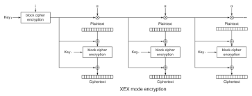
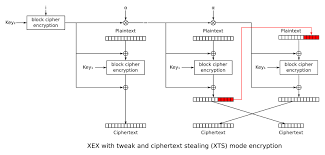
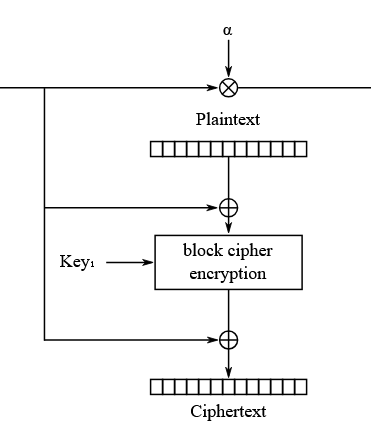

## SECURINETS_CTF_2025

### 1. Fl1pper Zer0

```py
from Crypto.Util.number import long_to_bytes, bytes_to_long, inverse
from Crypto.Cipher import AES
from Crypto.Util.Padding import pad
from fastecdsa.curve import P256 as EC
from fastecdsa.point import Point
import os, random, hashlib, json
from secret import FLAG

class SignService:
    def __init__(self):
        self.G = Point(EC.gx, EC.gy, curve=EC)
        self.order = EC.q
        self.p = EC.p
        self.a = EC.a
        self.b = EC.b
        self.privkey = random.randrange(1, self.order - 1)
        self.pubkey = (self.privkey * self.G)
        self.key = os.urandom(16)
        self.iv = os.urandom(16)

    def generate_key(self):
        self.privkey = random.randrange(1, self.order - 1)
        self.pubkey = (self.privkey * self.G)

    def ecdsa_sign(self, message, privkey):
        z = int(hashlib.sha256(message).hexdigest(), 16)
        k = random.randrange(1, self.order - 1)
        r = (k*self.G).x % self.order
        s = (inverse(k, self.order) * (z + r*privkey)) % self.order
        return (r, s)

    def ecdsa_verify(self, message, r, s, pubkey):
        r %= self.order
        s %= self.order
        if s == 0 or r == 0:
            return False
        z = int(hashlib.sha256(message).hexdigest(), 16)
        s_inv = inverse(s, self.order)
        u1 = (z*s_inv) % self.order
        u2 = (r*s_inv) % self.order
        W = u1*self.G + u2*pubkey
        return W.x == r

    def aes_encrypt(self, plaintext):
        cipher = AES.new(self.key, AES.MODE_GCM, nonce=self.iv)
        ct, tag = cipher.encrypt_and_digest(plaintext)
        return tag + ct

    def aes_decrypt(self, ciphertext):
        tag, ct = ciphertext[:16], ciphertext[16:]
        cipher = AES.new(self.key, AES.MODE_GCM, nonce=self.iv)
        plaintext = cipher.decrypt_and_verify(ct, tag)
        return plaintext

    def get_flag(self):
        key = hashlib.sha256(long_to_bytes(self.privkey)).digest()[:16]
        cipher = AES.new(key, AES.MODE_ECB)
        encrypted_flag = cipher.encrypt(pad(FLAG.encode(), 16))
        return encrypted_flag


if __name__ == '__main__':
    print("Welcome to Fl1pper Zer0 – Signing Service!\n")

    S = SignService()

    signkey = S.aes_encrypt(long_to_bytes(S.privkey))

    print(f"Here is your encrypted signing key, use it to sign a message : {json.dumps({'pubkey': {'x': hex(S.pubkey.x), 'y': hex(S.pubkey.y)}, 'signkey': signkey.hex()})}")

    while True:
        print("\nOptions:\n \
    1) sign <message> <signkey> : Sign a message\n \
    2) verify <message> <signature> <pubkey> : Verify the signed message\n \
    3) generate_key : Generate a new signing key\n \
    4) get_flag : Get the flag\n \
    5) quit : Quit\n")

        try:
            inp = json.loads(input('> '))

            if 'option' not in inp:
                print(json.dumps({'error': 'You must send an option'}))

            elif inp['option'] == 'sign':
                msg = bytes.fromhex(inp['msg'])
                signkey = bytes.fromhex(inp['signkey'])
                sk = bytes_to_long(S.aes_decrypt(signkey))

                r, s = S.ecdsa_sign(msg, sk)
                print(json.dumps({'r': hex(r), 's': hex(s)}))

            elif inp['option'] == 'verify':
                msg = bytes.fromhex(inp['msg'])
                r = int(inp['r'], 16)
                s = int(inp['s'], 16)
                px = int(inp['px'], 16)
                py = int(inp['py'], 16)
                pub = Point(px, py, curve=EC)

                verified = S.ecdsa_verify(msg, r, s, pub)

                if verified:
                    print(json.dumps({'result': 'Success'}))
                else:
                    print(json.dumps({'result': 'Invalid signature'}))

            elif inp['option'] == 'generate_key':
                S.generate_key()
                signkey = S.aes_encrypt(long_to_bytes(S.privkey))
                print("Here is your *NEW* encrypted signing key :")
                print(json.dumps({'pubkey': {'x': hex(S.pubkey.x), 'y': hex(S.pubkey.y)}, 'signkey': signkey.hex()}))

            elif inp['option'] == 'get_flag':
                encrypted_flag = S.get_flag()
                print(json.dumps({'flag': encrypted_flag.hex()}))

            elif inp['option'] == 'quit':
                print("Adios :)")
                break

            else:
                print(json.dumps({'error': 'Invalid option'}))
        
        except Exception:
            print(json.dumps({'error': 'Oops! Something went wrong'}))
            break
```

* Service là 1 signing service P-256 (fastecdsa). Private key `self.privkey` được sinh bằng `random.randrange(...)` (Python `random` / MT19937), public key là `privkey * G`.
* `signkey` được in ra cho client: đó là AES-GCM encryption của `long_to_bytes(self.privkey)` bằng **một cặp (self.key, self.iv) cố định trong suốt phiên chạy**. (Xem `SignService` trong `chall.py`.) 
* `get_flag()` tạo `key = sha256(long_to_bytes(self.privkey))[:16]` và mã hoá FLAG bằng AES-ECB với key đó — nên nếu biết `privkey` → giải mã flag. 

Hai lỗ hổng chính exploited trong 2 giải pháp:

1. **AES-GCM reuse of (key, nonce)** → cho phép phục hồi/forgery tag / thao tác ciphertext (do GHASH tuyến tính).
2. **Dùng Python `random` (MT19937) cho privkey** → PRNG có trạng thái có thể phục hồi nếu thu đủ output tuyến tính → dự đoán/private key.

---

#### cách 1: **GCM forgery + bit-by-bit private key recovery** (mô tả và từng bước)

##### Ý tưởng tổng quát

1. Vì AES-GCM được dùng **với cùng key và cùng nonce (iv)** cho mọi signkey, GHASH trong GCM dùng cùng (H = E_K(0^{128})). GHASH là tuyến tính trên GF(2) theo ciphertext và AAD — từ đó ta **có thể phục hồi H** hoặc dùng hai cặp (tag, ct) để tạo tag hợp lệ cho một ciphertext khác (forgery). (Mô-đun `aes_gcm_forgery` bạn import thực hiện hai việc này: `recover_possible_auth_keys` và `forge_tag_from_ciphertext`.)
2. Nếu ta thay đổi ciphertext bằng cách xoáy 1 bit (tức thay `ct` thành `ct' = ct xor mask`) và sau đó **forgery tag tương ứng**, server sẽ `decrypt_and_verify` thành công và trả về plaintext mới (= privkey xor mask).
3. Dùng plaintext giả đó như “private key” để gọi hành động `sign` → server dùng private key giả (privkey xor 2^i) ký message. Từ signature đó, với khả năng `verify` (server cho phép verify với public key tùy ý), ta có thể xác định bit i của privkey gốc bằng cách so sánh signature với điểm công khai `pub ± (1<<i) * G`.

   * Lý do: public key tương ứng với private `priv ± 2^i` là `pub ± (1<<i)*G`. Kiểm tra hợp lệ với hai khả năng cho biết bit đó là 0 hay 1.
4. Lặp cho i = 0..255 (hoặc bao nhiêu bit khóa dài) để xây lại toàn bộ `privkey`, sau đó giải AES-ECB flag.

##### Cách giải

* `orcale_generate_key()` gọi `generate_key` trên server và lấy JSON trả về (một `signkey` mới). Mình lấy hai lần để phục hồi H. 
* `recover_possible_auth_keys(...)` (từ `aes_gcm_forgery`) nhận hai cặp (tag,ct) và trả về giá trị GHASH hoặc candidates cho H.
* `for i in range(256):`:

  * Build `mask` = 1 << i (đóng gói thành bytes) và `fake_ct = origin_ct ^ mask`.
  * `forge_tag_from_ciphertext(H_x, aad_orig, origin_ct, origin_tag, aad_new, fake_ct)` tạo tag hợp lệ cho `fake_ct`.
  * Gửi `sign` với `payload = forged_tag + fake_ct`. Server sẽ decrypt thành sk' = original_priv xor (1<<i) và trả signature `(r,s)`.
  * Tạo điểm `P_plus = pub + (1<<i) * G` và `P_minus = pub - (1<<i) * G`. Gọi `verify` cho signature với `P_plus` và `P_minus`. Nếu signature verify với `P_plus`, ta gán bit = 0, else 1. (Đoạn này trong code tuy ngược một chút về thứ tự bit — script xử lý `prv_bits[::-1]` khi convert.) 
* Khi thu được bitstring, chuyển thành integer, derive AES key `sha256(long_to_bytes(priv)).digest()[:16]`, decrypt flag. 

```python
from aes_gcm_forgery import *
from Crypto.Util.number import *
from Crypto.Cipher import AES
from Crypto.Util.Padding import pad
from fastecdsa.curve import P256 as EC
from fastecdsa.point import Point
import os, random, hashlib, json
os.environ["TERM"] = "linux"
from pwn import *
from tqdm import *

def get_connect():
    s = process(["python", "chall.py"])
    # context.log_level = "debug"
    return s

s = get_connect()

def orcale_verify(msg, r, s_, px, py):
    s.recvuntil(b"Quit\n\n> ")
    tmp = {}
    tmp["option"] = "verify"
    tmp["msg"] = msg
    tmp["r"] = r
    tmp["s"] = s_
    tmp["px"] = px
    tmp["py"] = py
    s.sendline(json.dumps(tmp).encode())
    return eval(s.recvline().decode().strip())

def orcale_sign(msg, signkey):
    s.recvuntil(b"Quit\n\n> ")
    tmp = {}
    tmp["option"] = "sign"
    tmp["msg"] = msg
    tmp["signkey"] = signkey
    s.sendline(json.dumps(tmp).encode())
    return eval(s.recvline().decode().strip())

def orcale_generate_key():
    s.recvuntil(b"Quit\n\n> ")
    tmp = {}
    tmp["option"] = "generate_key"
    s.sendline(json.dumps(tmp).encode())
    s.recvline()
    return eval(s.recvline().decode().strip())

def orcale_get_flag():
    s.recvuntil(b"Quit\n\n> ")
    tmp = {}
    tmp["option"] = "get_flag"
    s.sendline(json.dumps(tmp).encode())
    return eval(s.recvline().decode().strip())

signature = [orcale_generate_key() for i in range(2)]

H_x = [i for i in recover_possible_auth_keys(b"", bytes.fromhex(signature[0]["signkey"])[16:], bytes.fromhex(signature[0]["signkey"])[:16], b"", bytes.fromhex(signature[1]["signkey"])[16:], bytes.fromhex(signature[1]["signkey"])[:16])][0]
G = Point(EC.gx, EC.gy, curve=EC)
pub = Point(int(signature[1]['pubkey']["x"], 16), int(signature[1]['pubkey']["y"], 16), curve=EC)
origin_ct = bytes.fromhex(signature[1]["signkey"])[16:]
origin_tag = bytes.fromhex(signature[1]["signkey"])[:16]

prv_bits = ""
for i in trange(256):
    mask = long_to_bytes(1 << i)
    mask = b"\x00" * (32 - len(mask)) + mask
    fake_ct = xor(mask, origin_ct)
    payload = forge_tag_from_ciphertext(H_x, b"", origin_ct, origin_tag, b"", fake_ct) + fake_ct
    sig = orcale_sign("00", payload.hex())
    P_plus = pub + (1 << i) * G
    P_minus = pub - (1 << i) * G

    v_plus = orcale_verify("00", sig["r"], sig["s"], hex(P_plus.x)[2:], hex(P_plus.y)[2:])
    v_minus = orcale_verify("00", sig["r"], sig["s"], hex(P_minus.x)[2:], hex(P_minus.y)[2:])
    
    if v_plus["result"] == "Success":
        prv_bits += "0"
    else:
        prv_bits += "1"
        
flag_data = orcale_get_flag()

key = hashlib.sha256(long_to_bytes(int(prv_bits[::-1], 2))).digest()[:16]
cipher = AES.new(key, AES.MODE_ECB)
encrypted_flag = cipher.decrypt(bytes.fromhex(flag_data['flag']))
print(encrypted_flag)
```

#### Cách 2: **Phục hồi trạng thái MT19937 + keystream mask bằng linear algebra**


##### Ý tưởng tổng quát

* `privkey` được sinh bằng `random.randrange(1, order-1)` — Python `random` = MT19937. MT19937 là tuyến tính trên GF(2) (mỗi output 32-bit liên quan tuyến tính đến trạng thái). Nếu ta có nhiều output (hoặc quan hệ tuyến tính tới output), ta có thể khôi phục toàn bộ trạng thái MT (624 words × 32 bits).
* Do AES-GCM dùng cùng keystream (same key & nonce) → mọi ciphertext `ct_i = priv_i XOR keystream` (ở dạng 256-bit nếu priv được biểu diễn thành 32 bytes). Vì keystream cố định, ta quan sát `obs_i = ct_i` và ta biết obs_i = keystream_mask XOR f(mt_output_i) (f là cách Python lấy bit từ RNG cho `randrange`).
* Dùng công cụ `gf2bv.LinearSystem` (và mô-đun `MT19937` symbolic) để tạo hệ phương trình tuyến tính trên GF(2) với 624*32 + 256 unknowns (state words plus keystream mask). Giải hệ sẽ trả về trạng thái MT và mask.
* Sau khi phục hồi trạng thái MT, ta có thể dự đoán giá trị `random.randrange(...)` tiếp theo — do đó biết private key hiện tại dùng để derive flag key. Dùng giá trị đó giải AES-ECB flag.

### 2. Fl0pper Zer1

```py
from sage.all import *
from Crypto.Util.number import long_to_bytes, bytes_to_long, inverse
from Crypto.Cipher import AES
from Crypto.Util.Padding import pad
from fastecdsa.curve import P256 as EC
from fastecdsa.point import Point
import os, random, hashlib, json

# load('secret.sage')
FLAG = "aaaaaaaaaaaaaaaaaaaaaaaa"

class SecureSignService:
    def __init__(self):
        self.G = Point(EC.gx, EC.gy, curve=EC)
        self.order = EC.q
        self.p = EC.p
        self.a = EC.a
        self.b = EC.b
        self.privkey = random.randrange(1, self.order - 1)
        self.pubkey = (self.privkey * self.G)
        self.key = os.urandom(16)
        self.iv = os.urandom(16)

    def split_privkey(self, privkey):
        shares = []
        coeffs = [privkey]
        for _ in range(3):
            coeffs.append(random.randrange(1, self.order))

        P.<x> = PolynomialRing(GF(self.order))
        poly = sum(c*x^i for i, c in enumerate(coeffs))

        for x in range(1, 5):
            y = poly(x=x)
            shares.append((x, y))
        return shares

    def reconstruct_privkey(self, shares):
        P.<x> = PolynomialRing(GF(self.order))
        reconst_poly = P.lagrange_polynomial(shares)
        return int(reconst_poly(0))

    def shares_encrypt(self, shares):
        return [self.aes_encrypt(long_to_bytes(int(s[1]))).hex() for s in shares]

    def shares_decrypt(self, shares):
        return [(x+1, bytes_to_long(self.aes_decrypt(bytes.fromhex(y)))) for x, y in enumerate(shares)]

    def generate_key(self):
        self.privkey = random.randrange(1, self.order - 1)
        self.pubkey = (self.privkey * self.G)

    def ecdsa_sign(self, message, privkey):
        z = int(hashlib.sha256(message).hexdigest(), 16)
        k = random.randrange(1, self.order - 1)
        r = (k*self.G).x % self.order
        s = (inverse(k, self.order) * (z + r*privkey)) % self.order
        return (r, s)

    def ecdsa_verify(self, message, r, s, pubkey):
        r %= self.order
        s %= self.order
        if s == 0 or r == 0:
            return False
        z = int(hashlib.sha256(message).hexdigest(), 16)
        s_inv = inverse(s, self.order)
        u1 = (z*s_inv) % self.order
        u2 = (r*s_inv) % self.order
        W = u1*self.G + u2*pubkey
        return W.x == r

    def aes_encrypt(self, plaintext):
        cipher = AES.new(self.key, AES.MODE_GCM, nonce=self.iv)
        ciphertext, tag = cipher.encrypt_and_digest(plaintext)
        return tag + ciphertext

    def aes_decrypt(self, ciphertext):
        tag, ct = ciphertext[:16], ciphertext[16:]
        cipher = AES.new(self.key, AES.MODE_GCM, nonce=self.iv)
        plaintext = cipher.decrypt_and_verify(ct, tag)
        return plaintext

    def get_flag(self):
        key = hashlib.sha256(long_to_bytes(self.privkey)).digest()[:16]
        cipher = AES.new(key, AES.MODE_ECB)
        encrypted_flag = cipher.encrypt(pad(FLAG.encode(), 16))
        return encrypted_flag


if __name__ == '__main__':
    print("Welcome to Fl0pper Zer1 – Secure Signing Service!\n")

    S = SecureSignService()

    signkey = S.shares_encrypt(S.split_privkey(S.privkey))

    print(f"Here are your encrypted signing key shares, use them to sign a message : {json.dumps({'pubkey': {'x': hex(S.pubkey.x), 'y': hex(S.pubkey.y)}, 'signkey': signkey})}")
    
    while True:
        print("\nOptions:\n \
    1) sign <message> <signkey> : Sign a message\n \
    2) verify <message> <signature> <pubkey> : Verify the signed message\n \
    3) generate_key : Generate new signing key shares\n \
    4) get_flag : Get the flag\n \
    5) quit : Quit\n")

        try:
            inp = json.loads(input('> '))

            if 'option' not in inp:
                print(json.dumps({'error': 'You must send an option'}))

            elif inp['option'] == 'sign':
                msg = bytes.fromhex(inp['msg'])
                signkey = inp['signkey']
                sk = S.reconstruct_privkey(S.shares_decrypt(signkey))

                r, s = S.ecdsa_sign(msg, sk)
                print(json.dumps({'r': hex(r), 's': hex(s)}))

            elif inp['option'] == 'verify':
                msg = bytes.fromhex(inp['msg'])
                r = int(inp['r'], 16)
                s = int(inp['s'], 16)
                px = int(inp['px'], 16)
                py = int(inp['py'], 16)
                pub = Point(px, py, curve=EC)

                verified = S.ecdsa_verify(msg, r, s, pub)

                if verified:
                    print(json.dumps({'result': 'Success'}))
                else:
                    print(json.dumps({'result': 'Invalid signature'}))

            elif inp['option'] == 'generate_key':
                S.generate_key()
                signkey = S.shares_encrypt(S.split_privkey(S.privkey))
                print("Here are your *NEW* encrypted signing key shares :")
                print(json.dumps({'pubkey': {'x': hex(S.pubkey.x), 'y': hex(S.pubkey.y)}, 'signkey': signkey}))

            elif inp['option'] == 'get_flag':
                encrypted_flag = S.get_flag()
                print(json.dumps({'flag': encrypted_flag.hex()}))

            elif inp['option'] == 'quit':
                print("Adios :)")
                break

            else:
                print(json.dumps({'error': 'Invalid option'}))
        
        except Exception as e:
            print(json.dumps({'error': 'Oops! Something went wrong'}))
            break
```

#### Ý tưởng tổng quát

$$
\begin{aligned}
&\text{Cho đa thức Shamir }f \text{ bậc }t-1\text{ với }f(0)=\text{priv},\quad y_j=f(x_j).[4pt]
&\text{Shamir nội suy tuyến tính tại }0:\qquad
f(0)=\sum_{j=1}^{t}\lambda_j,y_j \pmod{n},
\end{aligned}
$$

trong đó $(\lambda_j)$ là hệ số Lagrange phụ thuộc vào các (x_i) và (n) là group order.

Nếu ta thay (y_j) bằng (y_j') khác đi bởi một **mask** (m) (ví dụ (m=2^k) để lật 1 bit), tức

$$
y_j' = y_j \oplus m,
$$

thì do tuyến tính của việc nội suy (khi xem $(\oplus)$ là phép cộng trong $(\mathbb{Z}_n)$ nếu ta hiểu mask dưới dạng số), secret thay đổi theo

$$
f'(0) = f(0) + \lambda_j \cdot m \pmod{n}.
$$

Vì public key (Q = f(0),G) (với (G) là generator của elliptic curve), ta có public mới

$$
Q' = Q + (\lambda_j \cdot m),G.
$$

Do đó, **thay đổi một bit/byte trong một share tương ứng với dịch public trên đường thẳng (G)** — điều này là cốt lõi để nhận biết bit/byte bằng chữ ký.

---

#### Cách giải


   * Lấy public (Q) (server công bố).
   * Lấy 4 ciphertext (các blob) tương ứng 4 share (y_1,\dots,y_4) (mỗi blob = tag || ct). Vì server dùng **cùng khóa và cùng nonce** cho AES-GCM nhiều blob → GHASH key (H=E_K(0^{128})) cố định. Từ hai cặp (ct,tag) có thể phục hồi/H suy đoán hoặc dùng công cụ GHASH để **forge** tag hợp lệ cho bất kỳ ciphertext mới (ct^*).

   * Chọn share index (j) và chọn một **mask** (m) (ví dụ (m=2^k) để lật bit k, hoặc mask 1 byte để dò byte). Tạo ciphertext giả `ct' = ct_j \oplus m_bytes` (xor trên toàn bộ block bytes) và forge tag tương ứng.

   * Tính (\Delta = \lambda_j \cdot m \pmod{n}).
   * Tạo hai (hoặc nhiều) public candidate:
     $$
     Q_{\pm} = Q \pm \Delta G.
     $$
   * Kiểm tra chữ ký ((r,s)) với mỗi (Q_{\text{cand}}) bằng API `verify` (hoặc local verify).

     * Nếu chữ ký chỉ verify đúng với (Q_+) → kết luận bit/byte flip có dấu + (gọi là bit = 0 theo convention).
     * Nếu verify đúng với (Q_-) → kết luận bit/byte flip có dấu − (bit = 1).
   * Với probe **1 bit**, ta cần xác định ± (do ordering); với probe **1 byte** ta có thể brute-force 256 bits để tìm giá trị byte g sao cho (Q + \lambda_j (g\ll pos)G) verify.

   * Lặp cho mọi bit/byte của mọi share → thu được toàn bộ (y_1,\dots,y_4).
   * Nội suy Lagrange để lấy private:
     $$
     \text{priv} = \sum_{j=1}^{4}\lambda_j,y_j \pmod{n}.
     $$

```py
from aes_gcm_forgery import *
from Crypto.Util.number import *
from Crypto.Cipher import AES
from Crypto.Util.Padding import unpad
from fastecdsa.curve import P256 as EC
from fastecdsa.point import Point
import os, random, hashlib, json
from sage.all import *
from pwn import *

def get_connect():
    s = process(["sage", "chall.sage"])
    return s

s = get_connect()

def orcale_verify(msg, r, s_, px, py):
    s.recvuntil(b"Quit\n\n> ")
    tmp = {"option": "verify", "msg": msg, "r": r, "s": s_, "px": px, "py": py}
    s.sendline(json.dumps(tmp).encode())
    return eval(s.recvline().decode().strip())

def orcale_sign(msg, signkey):
    s.recvuntil(b"Quit\n\n> ")
    tmp = {"option": "sign", "msg": msg, "signkey": signkey}
    s.sendline(json.dumps(tmp).encode())
    return eval(s.recvline().decode().strip())

def orcale_generate_key():
    s.recvuntil(b"Quit\n\n> ")
    tmp = {"option": "generate_key"}
    s.sendline(json.dumps(tmp).encode())
    s.recvline()
    return eval(s.recvline().decode().strip())

def orcale_get_flag():
    s.recvuntil(b"Quit\n\n> ")
    tmp = {"option": "get_flag"}
    s.sendline(json.dumps(tmp).encode())
    return eval(s.recvline().decode().strip())

def lagrange_coeffs(x_values, order):
    coeffs = []
    for j in range(len(x_values)):
        num = 1
        denom = 1
        for i in range(len(x_values)):
            if i != j:
                num *= -x_values[i]
                denom *= (x_values[j] - x_values[i])
        coeff = (num * inverse_mod(denom, order)) % order
        coeffs.append(coeff)
    return coeffs

signature = [orcale_generate_key() for _ in range(2)]
G = Point(EC.gx, EC.gy, curve=EC)
pub = Point(int(signature[1]['pubkey']['x'], 16), int(signature[1]['pubkey']['y'], 16), curve=EC)
signkey_shares = signature[1]['signkey'] 
x_values = [1, 2, 3, 4] 
order = EC.q

lambda_coeffs = lagrange_coeffs(x_values, order)

H_x = None
for i in range(4):
    ct0, tag0 = bytes.fromhex(signature[0]['signkey'][i])[16:], bytes.fromhex(signature[0]['signkey'][i])[:16]
    ct1, tag1 = bytes.fromhex(signature[1]['signkey'][i])[16:], bytes.fromhex(signature[1]['signkey'][i])[:16]
    H_x = [i for i in recover_possible_auth_keys(b"", ct0, tag0, b"", ct1, tag1)][0]
    if H_x:
        break

recovered_shares = []
for j in range(4):  # 4 shares
    orig_ct = bytes.fromhex(signkey_shares[j])[16:]
    orig_tag = bytes.fromhex(signkey_shares[j])[:16]
    y_j_bits = ""
    for i in range(256):
        mask = long_to_bytes(1 << i)
        mask = b"\x00" * (32 - len(mask)) + mask  # Đảm bảo 32 byte
        new_ct = xor(orig_ct, mask)
        payload = forge_tag_from_ciphertext(H_x, b"", orig_ct, orig_tag, b"", new_ct) + new_ct
        new_signkey = signkey_shares[:j] + [payload.hex()] + signkey_shares[j+1:]
        
        sig = orcale_sign("00", new_signkey)
        delta = int((lambda_coeffs[j] * pow(2, i, order)) % order)
        Q_plus = pub + (delta * G)
        Q_minus = pub - (delta * G)
        
        v_plus = orcale_verify("00", sig["r"], sig["s"], hex(Q_plus.x)[2:], hex(Q_plus.y)[2:])
        v_minus = orcale_verify("00", sig["r"], sig["s"], hex(Q_minus.x)[2:], hex(Q_minus.y)[2:])
        
        if v_plus["result"] == "Success":
            y_j_bits += "0"
        elif v_minus["result"] == "Success":
            y_j_bits += "1"
        else:
            print(f"Error at share {j}, bit {i}")
            break

    recovered_shares.append((j + 1, int(y_j_bits[::-1], 2)))

from sage.all import *

P = PolynomialRing(GF(EC.q), 'x')
x = P.gen()
reconst_poly = P.lagrange_polynomial(recovered_shares)

privkey = int(reconst_poly(0))

flag_data = orcale_get_flag()
enc_flag = bytes.fromhex(flag_data["flag"])
key = hashlib.sha256(long_to_bytes(privkey)).digest()[:16]
cipher = AES.new(key, AES.MODE_ECB)
flag = cipher.decrypt(enc_flag)
print("Flag:", flag)
```

### 3. Exclusive

```py
from cryptography.hazmat.primitives.ciphers import Cipher, algorithms, modes
import os, signal
# from secret import FLAG
FLAG = b"qwertyuiopasdfghjklzxcvbnm"

signal.alarm(30)

class AES_XTS:
    def __init__(self):
        self.key = os.urandom(64)
        self.tweak = os.urandom(16)

    def encrypt(self, plaintext):
        encryptor = Cipher(algorithms.AES(self.key), modes.XTS(self.tweak)).encryptor()
        return encryptor.update(plaintext)

    def decrypt(self, ciphertext):
        decryptor = Cipher(algorithms.AES(self.key), modes.XTS(self.tweak)).decryptor()
        return decryptor.update(ciphertext)


if __name__ == '__main__':
    print("Welcome! Exclusive contents awaits, but you'll have to figure it out yourself.")

    cipher = AES_XTS()

    blocks = [FLAG[i:i+16] for i in range(0, len(FLAG), 16)]

    try:
        print(f"Select a block number to generate a clue (1-{len(blocks)})")
        ind = int(input('> '))
        
        clue = cipher.encrypt(os.urandom(16) + blocks[ind-1])        
        print(f"Your clue : {clue.hex()}")

        while True:
            print("Submit the clue (in hex)")
            your_clue = bytes.fromhex(input('> '))

            decrypted = cipher.decrypt(your_clue)
            decrypted_blocks = [decrypted[i:i+16] for i in range(0, len(decrypted), 16)]

            exclusive_content = decrypted_blocks[0]
            print(f"Exclusive content : {exclusive_content.hex()}")

    except:
        print('Oops! Something went wrong')
```

#### AES-XTS Mode

AES-XTS là chế độ mã hóa được thiết kế cho ổ đĩa:
- Sử dụng khóa 512-bit (64 bytes) và tweak 128-bit (16 bytes)
- Mã hóa từng block 16 bytes một cách độc lập
- Có cơ chế đặc biệt gọi là **ciphertext stealing** để xử lý block cuối không đủ 16 bytes

#### Ciphertext Stealing

Đây là cơ chế quan trọng nhất để hiểu bài này.

**Tình huống:** Giả sử ta có 2 block plaintext:
- Block 1: $P_1$ (16 bytes đầy đủ) 
- Block 2: $P_2$ (chỉ có 10 bytes - không đủ 16 bytes)

**Mã hóa thông thường (không có ciphertext stealing):**
- $C_1 = Enc(P_1)$
- $C_2 = Enc(P_2)$ ← **Không thể làm vì $P_2$ chỉ có 10 bytes!**



**Mã hóa với ciphertext stealing:**

1. Mã hóa block đầy đủ: $C_1 = Enc(P_1)$ → được 16 bytes
2. Lấy 10 bytes đầu của $C_1$, gọi là $C_1[0:10]$
3. Nối $P_2$ (10 bytes) với 6 bytes cuối của $C_1$: $P_2 || C_1[10:16]$ → được 16 bytes
4. Mã hóa cái này: $C_1' = Enc(P_2 || C_1[10:16])$



**Kết quả cuối cùng được hoán đổi vị trí:**
- Output block 1: $C_1' = Enc(P_2 || C_1[10:16])$ (16 bytes)
- Output block 2: $C_2 = C_1[0:10]$ (10 bytes)


#### Cách Giải

Server có 2 điểm yếu:
1. **Cho phép giải mã bất kỳ ciphertext nào** ta gửi lên
2. **Chỉ trả về block đầu tiên** của plaintext sau khi giải mã

Ta sẽ lợi dụng điều này để:
- Thao túng thứ tự các block
- Dùng ciphertext stealing để leak từng byte một
- So sánh các output để brute-force flag

---

#### Khôi phục các block đầy đủ (16 bytes)

Ta chọn block 1 của flag. Server sẽ:
- Tạo 16 bytes ngẫu nhiên: $R = [r_0, r_1, ..., r_{15}]$
- Nối với block flag: $R || FLAG_{block1}$
- Mã hóa: $Enc(R || FLAG_{block1})$

Ta nhận được 32 bytes ciphertext:
```
C = C1 || C2
```
Trong đó:
- $C1 = Enc(R)$ (16 bytes)
- $C2 = Enc(FLAG_{block1})$ (16 bytes)


Ta gửi lên server để giải mã: $C2 || C1[0:15]$

```
┌─────────────────┬──────────────┐
│   C2 (16 bytes) │ C1 (15 bytes)│ ← Chỉ lấy 15 bytes đầu của C1
└─────────────────┴──────────────┘
```

Vì block thứ 2 chỉ có 15 bytes (không đủ 16), ciphertext stealing được kích hoạt!

Theo cơ chế ciphertext stealing, server sẽ:

1. Giải mã block đầu tiên: $Dec(C2) = FLAG_{block1}$
2. Lấy 15 bytes đầu của kết quả: $FLAG_{block1}[0:15]$
3. Ghép 15 bytes của $C1$ với byte cuối của $FLAG_{block1}$:
   ```
   New_input = C1[0:15] || FLAG_{block1}[15]
   ```
4. Giải mã: $Dec(New\_input)$

Do hoán đổi trong ciphertext stealing, server trả về:

```
S = Dec(C1[0:15] || FLAG_{block1}[15])
```

Ta có được giá trị $S$ phụ thuộc vào byte cuối của flag

Bây giờ ta thử tất cả 256 giá trị có thể cho byte cuối:

```
Với mỗi candidate từ 0 đến 255:
    1. Tạo payload: C1[0:15] || bytes([candidate])
    2. Gửi lên server giải mã
    3. Nhận về kết quả R
    4. So sánh R với S
    5. Nếu R == S → candidate chính là byte cuối của flag!
```
 
Ta chỉ leak được 15 bytes (từ byte 1 đến byte 15), vì cần ít nhất 1 byte ở block cuối để kích hoạt ciphertext stealing.

#### Khôi phục block cuối (không đủ 16 bytes)

Giả sử block cuối của flag chỉ có 10 bytes: $FLAG_{last} = [f_0, f_1, ..., f_9]$

Ta chọn block cuối. Server sẽ:
- Tạo $R$ (16 bytes ngẫu nhiên)
- Nối: $R || FLAG_{last}$ (16 + 10 = 26 bytes)
- Mã hóa theo ciphertext stealing

Ciphertext nhận được:
```
C = C1 || C2
```

Nhưng khác với trước, lần này:
- $C2 = Enc(R)[0:10]$ (10 bytes đầu của $Enc(R)$)
- $C1 = Enc(FLAG_{last} || Enc(R)[10:16])$ (flag 10 bytes + 6 bytes cuối của $Enc(R)$)

$ENC(R||flag) = C1 || C2$

Do cơ chế cipher stealing nên ta có
$DEC(C1||C2[:-1]) = R || flag [-1] || flag[:-1] = DEC(C1 || flag[-1] || C2[:-1])$

Ta không leak hết tất cả, vì cần ít nhất 1 byte ở block cuối để kích hoạt ciphertext stealing.
Nên ở mỗi vòng ta cần brute thủ công các string còn thiếu có thể vì ta đã có hash của flag.

```py
from pwn import *
from string import *
from tqdm import *

def get_connection():
    s = process(["python", "chall.py"])
    # context.log_level = "debug"
    # s = connect("exclusive.p2.securinets.tn", 6003)
    return s

def get_output(payload):
    for _ in payload:
        s.sendline(_.hex().encode())
    tmp = []
    for _ in range(len(payload)):
        s.recvuntil(b"Exclusive content : ")

        k = s.recvline()
        tmp.append(bytes.fromhex(k.decode()))
    return tmp


def get_block():
    s = get_connection()

    idx = 1
    flag = b""

    s.sendlineafter("> ", str(idx).encode())
    s.recvuntil(b"Your clue : ")

    enc_flag = bytes.fromhex(s.recvline().decode())
    print(len(enc_flag))
    for i in trange(15):
        
        tmp = get_output([enc_flag[16:] + enc_flag[:15 - i]])[0]

        payloads = []
        for candicate in range(256):
            payloads.append(enc_flag[16:] + enc_flag[:15 - i] + bytes([candicate]))
        output = get_output(payloads)
        for i in range(256):
            if tmp == output[i]:
                flag = bytes([i]) + flag

        print(flag)

    tmp = get_output([enc_flag[16:]])[0]

    payloads = []
    for candicate in range(256):
        payloads.append(bytes([candicate]) + flag + b"0" * 32)
    output = get_output(payloads)
    for i in range(256):
        if tmp == output[i][:16]:
            flag = bytes([i]) + flag

    print(flag)

def get_last_block():
    s = get_connection()

    idx = 2
    flag = b""

    s.sendlineafter("> ", str(idx).encode())
    s.recvuntil(b"Your clue : ")

    enc_flag = bytes.fromhex(s.recvline().decode())
    print(len(enc_flag))
    for i in trange(1, 15):
        
        tmp = get_output([enc_flag[:-i]])[0]

        payloads = []
        for candicate in range(256):
            payloads.append(enc_flag[:- i] + bytes([candicate]))
        output = get_output(payloads)
        for i in range(256):
            if tmp == output[i]:
                flag = bytes([i]) + flag

        print(flag)
```

### 4. XTaSy

```py
from cryptography.hazmat.primitives.ciphers import Cipher, algorithms, modes
import os, json
# from secret import FLAG
FLAG = "flag"

class AES_XTS:
    def __init__(self):
        self.key = os.urandom(64)
        self.tweak = os.urandom(16)

    def encrypt(self, plaintext):
        encryptor = Cipher(algorithms.AES(self.key), modes.XTS(self.tweak)).encryptor()
        return encryptor.update(plaintext.encode('latin-1'))

    def decrypt(self, ciphertext):
        decryptor = Cipher(algorithms.AES(self.key), modes.XTS(self.tweak)).decryptor()
        return decryptor.update(ciphertext)

def get_token(username, password):
    json_data = {
        "username": username,
        "password": password,
        "admin": 0
    }
    str_data = json.dumps(json_data, ensure_ascii=False)
    token = cipher.encrypt(str_data)
    return token

def check_admin(token):
    try:
        str_data = cipher.decrypt(token)
        json_data = json.loads(str_data)
        return json_data['admin']
    except:
        print(json.dumps({'error': f'Invalid JSON token "{str_data.hex()}"'}))
        return None


if __name__ == '__main__':
    print("Welcome to the XTaSy vault! You need to become a VIP (admin) to get a taste.")
    
    cipher = AES_XTS()
    
    while True:
        print("\nOptions:\n \
    1) get_token <username> <password> : Generate an access token\n \
    2) check_admin <token> : Check admin access\n \
    3) quit : Quit\n")

        try:
            inp = json.loads(input('> '))

        except:
            print(json.dumps({'error': 'Invalid JSON input'}))
            continue

        if 'option' not in inp:
            print(json.dumps({'error': 'You must send an option'}))

        elif inp['option'] == 'get_token':
            try:
                username = bytes.fromhex(inp['username']).decode('latin-1')
                password = bytes.fromhex(inp['password']).decode('latin-1')  
                token = get_token(username, password)
                print(json.dumps({'token': token.hex()}))
            
            except:
                print(json.dumps({'error': 'Invalid username or/and password'}))

        elif inp['option'] == 'check_admin':
            try:
                token = bytes.fromhex(inp['token'])
                assert len(token) >= 16

            except:
                print(json.dumps({'error': 'Invalid token'}))
                continue

            is_admin = check_admin(token)

            if is_admin is None:
                continue
            elif is_admin:
                print(json.dumps({'result': f'Access granted! Enjoy the taste of the flag {FLAG}'}))
            else:
                print(json.dumps({'result': 'Access denied!'}))

        elif inp['option'] == 'quit':
            print('Adios :)')
            break

        else:
            print(json.dumps({'error': 'Invalid option'}))
```

#### Chức năng của server

1. **get_token**: Tạo token từ username và password
   - Tạo JSON: `{"username": "xxx", "password": "yyy", "admin": 0}`
   - Mã hóa JSON bằng AES-XTS
   - Trả về token (ciphertext)

2. **check_admin**: Kiểm tra quyền admin
   - Giải mã token thành JSON
   - Kiểm tra giá trị `admin`
   - Nếu `admin == 1` → trả flag
   - Nếu JSON không hợp lệ → trả về plaintext giải mã được (trong error message)

#### Cách giải


```python
payload_1 = ["a" * 8, ""]  # username = "aaaaaaaa", password = ""
```

**JSON được tạo:**
```json
{"username": "aaaaaaaa", "password": "", "admin": 0}
```

**Phân tích độ dài:**
```
|<---16bytes--->|
{"username": "aa
aaaaaa", "passwo
rd": "", "admin"
: 0}
```

Cụ thể:
- Block 0: `{"username": "aa` (16 bytes)
- Block 1: `aaaaaa", "passwo` (16 bytes)
- Block 2: `rd": "", "admin"` (16 bytes)
- Block 3: `: 0}` (6 bytes - block ngắn!)


Với plaintext: `P[0] || P[1] || P[2] || P[3]`
Ciphertext : `C[0] || C[1] || C[2] || C[3]`

với ENC_i là mã hóa P[i] như sau:



thì ta có

`C[2] = ENC_3(P[3] + ENC_AES(P[2])[-len(P[3]) % 16:]) = ENC_3(":0 }" + ENC_AES(P[2])[-len(P[3]) % 16:])`

để admin = 1 thì ta chỉ cần - Block 3: `: 1}` là được nên ta có 
`C'[2] = ENC_3(":1 }" + ENC_AES(P[2])[-len(P[3]) % 16:])`

Vậy nên bây giờ mình cần tìm `ENC_AES(P[2])[-len(P[3]) % 16:]`.

mà `DEC_3(C[2]) = DEC_3(ENC_3(":0 }" + ENC_AES(P[2])[-len(P[3]) % 16:])) = ":0 }" + ENC_AES(P[2])[-len(P[3]) % 16:]`

nên ta đã có thể tìm được `ENC_AES(P[2])[-len(P[3]) % 16:]`

khi đó ta có thể padding block để tìm được C'[2]

- Block 0: `{"username": "aa` (16 bytes)
- Block 1: `aaaaaaaaaaaaaaaa` (16 bytes)
- Block 2: `aaaaaaaaaaaaaaaa` (16 bytes)
- Block 3: `: 0}` + ENC_AES(P[2])[-len(P[3]) % 16:] (16 bytes)
- Block 4: ....

Khi đó thì ta đã có C'[2] và có thể dễ dàng forged ciphertext như sau: `C[0] || C[1] || C'[2] || C[3]` là dễ dàng có flag.

```py

import os, json


def get_json(username, password):
    json_data = {
        "username": username,
        "password": password,
        "admin": 0
    }
    str_data = json.dumps(json_data, ensure_ascii=False)
    return str_data

def get_block(a):
    return [a[i: i + 16] for i in range(0, len(a), 16)]


from pwn import *

def get_connect():
    s = process(["python", "chall.py"])
    # s = connect("xtasy.p2.securinets.tn", 6001)
    # context.log_level = "debug"
    return s

def check_admin(s, token):
    s.recvuntil(b'> ')
    s.recvuntil(b'> ')
    s.recvuntil(b'> ')
    s.recvuntil(b'> ')
    tmp = {}
    tmp['option'] = 'check_admin'
    tmp['token'] = token
    s.sendline(json.dumps(tmp).encode())
    token = s.recvline()
    token = eval(token.decode().strip())
    if "result" in token:
        return token
    else:
        return bytes.fromhex(token["error"][20:-1])

def get_token(s, username, password):
    s.recvuntil(b'> ')
    s.recvuntil(b'> ')
    s.recvuntil(b'> ')
    s.recvuntil(b'> ')
    tmp = {}
    tmp["option"] = 'get_token'
    tmp["username"] = username
    tmp["password"] = password
    s.sendline(json.dumps(tmp).encode())
    token = s.recvline()
    return bytes.fromhex(eval(token.decode().strip())["token"])

s = get_connect()

payload_1 = [b"a" * 8, b""]

for i in get_block(get_json(*["a" * 8, ""])):
    print(i)

c1 = get_block(get_token(s, payload_1[0].hex(), payload_1[1].hex()))

payload_2 = c1[0] + c1[1] + b"0" * (16) + c1[2] + b"0" * (2 * 16)
token_1 = (get_block(check_admin(s, payload_2.hex())))

payload_3 = [b"a" * (2 + 16 + 16) + b": 1}" + token_1[3][4:] + b"a" * 16, b""]

c2 = get_block(get_token(s, payload_3[0].hex(), payload_3[1].hex()))

for i in get_block(get_json(*["a" * (2 + 16 + 16) + ": 1}" + token_1[3][4:].decode('latin-1') + "a" * 16 , ""])):
    print(i)

payload_4 = c1[0] + c1[1] + c2[3] + c1[-1]

print(check_admin(s, payload_4.hex()))
```